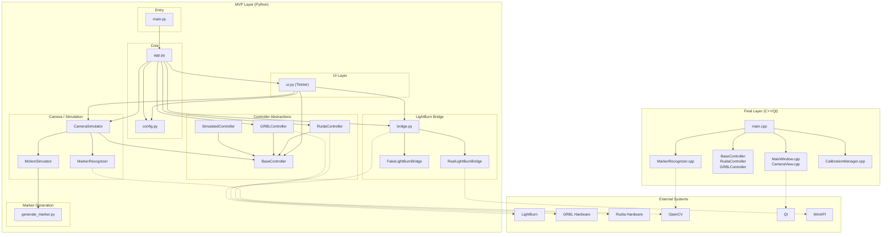

# LaserCam Dependency Graph



---

## Module Dependency Details

### MVP Python Layer

| Module | Imports | Depends On |
|--------|---------|------------|
| `main.py` | `mvp.app` | Entry point |
| `app.py` | bridge, camera_simulator, config, controller, ui | Application bootstrap |
| `config.py` | json, dataclasses | Pure config (no deps) |
| `controller.py` | math, re, socket, serial, abc | Base abstraction |
| `camera_simulator.py` | cv2, controller, recognizer, simulator | Camera + detection |
| `simulator.py` | cv2, numpy, generate_marker | Motion simulation |
| `recognizer.py` | cv2, numpy, math | OpenCV detection |
| `bridge.py` | platform, time, win32gui, pyautogui | LightBurn integration |
| `ui.py` | tkinter, cv2, PIL, bridge, camera, controller | Tkinter GUI |

### Final C++ Layer

| Module | Includes | Depends On |
|--------|----------|-----------|
| `main.cpp` | all | Entry point |
| `MainWindow.cpp` | Qt, CameraView | Qt UI |
| `CameraView.cpp` | Qt | Qt rendering |
| `BaseController.h` | pure virtual | Interface |
| `RuidaController.cpp` | BaseController | UDP protocol |
| `GRBLController.cpp` | BaseController | Serial protocol |
| `MarkerRecognizer.cpp` | opencv2/imgproc | OpenCV |
| `CalibrationManager.cpp` | core/ | Offset calculation |

---

## Data Flow

```
┌─────────────────────────────────────────────────────────────────────────────┐
│                              User Input (Tkinter UI)                        │
└─────────────────────────────────────────────────────────────────────────────┘
                                      │
                                      ▼
┌─────────────────────────────────────────────────────────────────────────────┐
│  ui.py: App.state machine                                                   │
│  - START → SEARCH_M1 → CONFIRM_M1 → REGISTER_M1 →                         │
│    SEARCH_M2 → CONFIRM_M2 → REGISTER_M2 → DONE → START                     │
└─────────────────────────────────────────────────────────────────────────────┘
                                      │
                    ┌─────────────────┼─────────────────┐
                    ▼                 ▼                 ▼
         ┌──────────────────┐ ┌───────────────┐ ┌────────────────────┐
         │ Camera Movement  │ │ Marker        │ │ LightBurn Bridge   │
         │ (controller.py)  │ │ Detection     │ │ (bridge.py)        │
         └──────────────────┘ │ (recognizer)  │ └────────────────────┘
                    │          └───────────────┘           │
                    ▼                                       ▼
         ┌──────────────────┐                     ┌───────────────┐
         │ BaseController   │                     │ Alt+1 / Alt+2 │
         │ - GRBL (serial)  │                     │ to LightBurn  │
         │ - Ruida (UDP)    │                     └───────────────┘
         │ - Simulated      │
         └──────────────────┘
                    │
                    ▼
         ┌──────────────────┐
         │ Hardware /       │
         │ Simulation       │
         └──────────────────┘
```

---

## Configuration Flow

```
lasercam.json
      │
      ▼
config.py (Config dataclass)
      │
      ├──────────────────────┬──────────────────────┐
      ▼                      ▼                      ▼
┌──────────────┐      ┌──────────────┐      ┌──────────────┐
│ GRBL params  │      │ Ruida params │      │ Camera params│
│ - port        │      │ - host       │      │ - FOV        │
│ - baudrate    │      │ - port       │      │ - resolution │
└──────────────┘      └──────────────┘      └──────────────┘
      │
      ▼
app.py → creates controller
```
